## 搭建自己的SSR、静态站点生成（SSG）及封装 Vue.js 组件库 （项目见：<https://github.com/smallSix6/fed-e-task-liuhuijun/tree/master/fed-e-task-03-04>

### 任务一：搭建自己的 SSR
#### 1、渲染一个 Vue 的实例
+ npm init -y
+ npm i vue vue-server-renderer
+ 根目录下新建 server.js
```js
const Vue = require('vue')
const renderer = require('vue-server-renderer').createRenderer()

const app = new Vue({
  template: `
      <div id="app">
        <h1> {{ message }}</h1 >
      </div >
  `,
  data: {
    message: '刘惠俊'
  }
})
renderer.renderToString(app, (err, html) => {
  if (err) throw err
  console.log(html)
})
```
+ 执行上述代码，结果如下：
```js
<div id="app" data-server-rendered="true"><h1> 刘惠俊</h1></div>
```

#### 2、使用 HTML 模板结合到 web 服务器中
+ index.template.html 中内容如下：
```js
<!DOCTYPE html>
<html lang="en">

<head>
  <meta charset="UTF-8">
  <meta name="viewport" content="width=device-width, initial-scale=1.0">
  {{{meta}}}
  <title>{{title}}</title>
</head>

<body>
  <!--vue-ssr-outlet-->
</body>

</html>
```
+ server.js 中内容如下：
```js
const Vue = require('vue')
const fs = require('fs')
const renderer = require('vue-server-renderer').createRenderer({
  template: fs.readFileSync('./index.template.html', 'utf-8')
})
const express = require('express')

const server = express()

server.get('/', (req, res) => {
  const app = new Vue({
    template: `
      <div id="app">
        <h1> {{ message }}</h1 >
      </div >
  `,
    data: {
      message: '刘惠俊'
    }
  })
  renderer.renderToString(app, {
    title: '刘惠俊',  // html 中用 {{title}}, title 字段会被解析
    meta: `<meta name="description" content="刘惠俊">`  // html 中用 {{{meta}}}, meta 字段不会被解析
  }, (err, html) => {
    if (err) {
      res.status(500).end('server Error')
    }
    res.setHeader('Content-Type', 'text/html;charset=utf8')
    res.end(html)
  })
})

server.listen(3000, () => {
  console.log('server running at port 3000')
})
```


#### 3、构建配置
+ 基本思路
  + 
+ 源码结构(< https://ssr.vuejs.org/zh/guide/structure.html#%E4%BD%BF%E7%94%A8-webpack-%E7%9A%84%E6%BA%90%E7%A0%81%E7%BB%93%E6%9E%84 >)
  + +src
    + -app.js
    ```js
    // 通用入口
    import Vue from 'vue'
    import App from './App.vue'

    // 导出一个工厂函数，用于创建新的
    // 应用程序、router 和 store 实例
    export function createApp() {
      const app = new Vue({
        // 根实例简单的渲染应用程序组件。
        render: h => h(App)
      })
      return { app }
    }
    ```
    + -App.vue
    ```js
    <template>
      <div id="app">
        <h1>{{message}}</h1>
        <h2>客户端动态交互</h2>
        <div>
          <input v-model="message" />
        </div>
        <div>
          <button @click="onClick">点击测试</button>
        </div>
      </div>
    </template>

    <script>
    export default {
      name: "App",
      data() {
        return {
          message: "拉钩教育"
        };
      },
      methods: {
        onClick() {
          console.log("Hello World!");
        }
      }
    };
    </script>

    <style scoped>
    </style>
    ```
    + -entry-client.js
    ```js
    import { createApp } from './app'

    // 客户端特定引导逻辑……

    const { app } = createApp()

    // 这里假定 App.vue 模板中根元素具有 `id="app"`
    app.$mount('#app')
    ```
    + -entry-server.js
    ```js
    import { createApp } from './app'

    export default context => {
      const { app } = createApp()
      return app
    }
    ```
+ 安装依赖
  + 构建配置
    1. 安装生产依赖
      + npm i vue vue-server-renderer express cross-env

      |包                    |说明|
      |  -----              | -----|
      |vue                  | Vue.js 核心库|
      |vue-server-renderer  | Vue 服务端渲染工具|
      |express              | 基于 Node 的 Web 服务框架|
      |cross-env            | 通过 npm scripts 设置跨平台环境变量|
    2. 安装开发依赖
      + npm i -D webpack webpack-cli webpack-merge webpack-node-externals @babel/core @babel/plugin-transform-runtime @babel/preset-env babel-loader css-loader url-loader file-loader rimraf vue-loader vue-template-compiler friendly-errors-webpack-plugin
      + 
+ webpack 配置文件
  + 根目录新建 build 文件夹，文件夹中的子文件如下：
    + webpack.base.config.js
    ```js
    /* 
    公共配置
    */

    const VueLoaderPlugin = require('vue-loader/lib/plugin')
    const path = require('path')
    const FriendlyErrorsWebpackPlugin = require('friendly-errors-webpack-plugin')
    const resolve = file => path.resolve(__dirname, file)

    const isProd = process.env.NODE_ENV === 'production'

    module.exports = {
      mode: isProd ? 'production' : 'development',
      output: {
        path: resolve('../dist/'),
        publicPath: '/dist/',
        filename: '[name].[chunkhash].js'
      },
      resolve: {
        alias: {
          // 路径别名，@ 指向 src
          '@': resolve('../src/')
        },
        // 可以省略的扩展名
        // 当省略扩展名的时候，按照从前往后的顺序依次解析
        extensions: ['.js', '.vue', '.json']
      },
      devtool: isProd ? 'source-map' : 'cheap-module-eval-source-map',
      module: {
        rules: [
          // 处理图片资源
          {
            test: /\.(png|jpg|gif)$/i,
            use: [
              {
                loader: 'url-loader',
                options: {
                  limit: 8192,
                }
              }
            ]
          },
          // 处理字体资源
          {
            test: /\.(woff|woff2|eot|ttf|otf)$/,
            use: ['file-loader']
          },
          // 处理 .vue 资源
          {
            test: /\.vue$/,
            loader: 'vue-loader'
          },
          // 处理 css 资源
          // 它会应用到普通的 .css 文件
          // 以及 .vue 文件中的 style 块
          {
            test: /\.css$/,
            use: [
              'vue-style-loader',
              'css-loader'
            ]
          },
          // css 预处理器
          // 例如处理 less 资源
          // {
          //   test: /\.less$/,
          //   use: [
          //     'vue-style-loader',
          //     'css-loader',
          //     'less-loader'
          //   ]
          // }
        ]
      },
      plugins: [
        new VueLoaderPlugin(),
        new FriendlyErrorsWebpackPlugin()
      ]
    }
    ```
    + webpack.client.config.js
    ```js
    /* 
    客户端打包配置
    */
    const { merge } = require('webpack-merge')
    const baseConfig = require('./webpack.base.config')
    const VueSSRClientPlugin = require('vue-server-renderer/client-plugin')

    module.exports = merge(baseConfig, {
      entry: {
        app: './src/entry-client.js'
      },
      module: {
        rules: [
          // ES6 转 ES5
          {
            test: /\.m?js/,
            exclude: /(node_modules|brower_components)/,
            use: {
              loader: 'babel-loader',
              options: {
                presets: ['@babel/preset-env'],
                cacheDirectory: true,
                plugins: ['@babel/plugin-transform-runtime']
              }
            }
          }
        ]
      },
      // 重要信息：这将 webpack 运行时分离到一个引导 chunk 中
      // 以便可以在之后正确注入异步 chunk
      optimization: {
        splitChunks: {
          name: 'manifest',
          minChunks: Infinity
        }
      },
      plugins: [
        // 此插件在输出目录中生成 'vue-ssr-client-manifest.json'
        new VueSSRClientPlugin()
      ]
    })
    ```
    + webpack.server.config.js
    ```js
    /* 
    服务端打包配置
    */
    const { merge } = require('webpack-merge')
    const nodeExternals = require('webpack-node-externals')
    const baseConfig = require('./webpack.base.config')
    const VueSSRClientPlugin = require('vue-server-renderer/server-plugin')

    module.exports = merge(baseConfig, {
      // 将 entry 指向应用程序的 server entry 文件
      entry: './src/entry-server.js',

      // 这允许 webpack 以 Node 使用方式处理模块加载
      // 并且还会在编译 Vue 组件时，告知 vue-loader 输送面向服务器代码（server-oriented code)
      target: 'node',
      output: {
        filename: 'server-bundle.js',
        // 此处告知 server bundle 使用 Node 风格导出模块 (Node-style exports)
        libraryTarget: 'commonjs2'
      },
      // 不打包 node_modules 第三方包，而是保留 require 方式直接加载
      externals: [nodeExternals({
        // 白名单中的资源依然正常打包
        allowlist: [/\.css$/]
      })],
      plugins: [
        // 这是将服务器的整个输出构建为单个 JSON 文件的插件
        // 默认文件名为 vue-ssr-server-bundle.json
        new VueSSRClientPlugin()
      ]
    })
    ```
+ 配置构建文件
  + package.json 中新增 script 命令
  ```js
  "scripts": {
    "build:client": "cross-env NODE_ENV=production webpack --config build/webpack.client.config.js",
    "build:server": "cross-env NODE_ENV=production webpack --config build/webpack.server.config.js",
    "build": "rimraf dist && npm run build:client && npm run build:server"
  },
  ```
+ 启动应用
  + 根目录下的 server.js 如下
  ```js
  const Vue = require('vue')
  const fs = require('fs')
  const serverBundle = require('./dist/vue-ssr-server-bundle.json')
  const template = fs.readFileSync('./index.template.html', 'utf-8')
  const clientManifest = require('./dist/vue-ssr-client-manifest.json')
  const renderer = require('vue-server-renderer').createBundleRenderer(serverBundle, {
    // runInNewContext: false, // 推荐
    template, // （可选）页面模板
    clientManifest // （可选）客户端构建 manifest
  })
  const express = require('express')
  const server = express()
  server.use('/dist', express.static('./dist'))
  server.get('/', (req, res) => {

    renderer.renderToString({
      title: '刘惠俊',  // html 中用 {{title}}, title 字段会被解析
      meta: `<meta name="description" content="刘惠俊">`  // html 中用 {{{meta}}}, meta 字段不会被解析
    }, (err, html) => {
      if (err) {
        res.status(500).end('server Error')
      }
      res.setHeader('Content-Type', 'text/html;charset=utf8')
      res.end(html)
    })
  })
  server.listen(3000, () => {
    console.log('server running at port 3000')
  })
  ```
+ 解析渲染流程
  > 注意：在开发模式下，Vue 将推断客户端生成的虚拟 DOM 树 (virtual DOM tree)，是否与从服务器渲染的 DOM 结构 (DOM structure) 匹配。如果无法匹配，它将退出混合模式，丢弃现有的 DOM 并从头开始渲染。**在生产模式下，此检测会被跳过，以避免性能损耗。**
  + 一些需要注意的坑：
    + 使用「SSR + 客户端混合」时，需要了解的一件事是，浏览器可能会更改的一些特殊的 HTML 结构。例如，当你在 Vue 模板中写入：
    ```js
    <table>
      <tr><td>hi</td></tr>
    </table>
    ```
    + 浏览器会在 <table> 内部自动注入 <tbody>，然而，由于 Vue 生成的虚拟 DOM (virtual DOM) 不包含 <tbody>，所以会导致无法匹配。为能够正确匹配，请确保在模板中写入有效的 HTML。

#### 4、构建配置开发模式
+ 基本思路：
  + package.json 中新增 script 命令：
    ```js
    "start": "cross-env NODE_ENV=production node server.js",
    "dev": "node server.js"
    ```
  + 更新 server.js 中的代码如下：
  ```js
  const Vue = require('vue')
  const fs = require('fs')

  const isProd = process.env.NODE_ENV === 'production'
  let renderer

  if (isProd) {
    const serverBundle = require('./dist/vue-ssr-server-bundle.json')
    const template = fs.readFileSync('./index.template.html', 'utf-8')
    const clientManifest = require('./dist/vue-ssr-client-manifest.json')
    renderer = require('vue-server-renderer').createBundleRenderer(serverBundle, {
      // runInNewContext: false, // 推荐
      template, // （可选）页面模板
      clientManifest // （可选）客户端构建 manifest
    })
  } else {
    // 开发模式 -> 监视打包构建 -> 重新生成 Renderer 渲染器

  }

  const express = require('express')
  const server = express()
  server.use('/dist', express.static('./dist'))

  const render = (req, res) => {
    renderer.renderToString({
      title: '刘惠俊',  // html 中用 {{title}}, title 字段会被解析
      meta: `<meta name="description" content="刘惠俊">`  // html 中用 {{{meta}}}, meta 字段不会被解析
    }, (err, html) => {
      if (err) {
        res.status(500).end('server Error')
      }
      res.setHeader('Content-Type', 'text/html;charset=utf8')
      res.end(html)
    })
  }
  server.get('/', isProd
    ? render
    : (req, res) => {
      // TODO:等待有了 Renderer 渲染器以后，调用 render 进行渲染
      render()
    }
  )
  server.listen(3000, () => {
    console.log('server running at port 3000')
  })
  ```
+ 提取处理模块
  + 根目录下新建 setup-dev-server.js，代码如下：
  ```js
  module.exports = (server, callback) => {
    const onReady = new Promise()

    // 监视构建 -> 更新 Renderer

    return onReady
  }
  ```
  + 更新 server.js 中的代码如下：
  ```js
  const Vue = require('vue')
  const fs = require('fs')
  const { createBundleRenderer } = require('vue-server-renderer')
  const setupDevServer = require('./build/setup-dev-server')


  const express = require('express')
  const server = express()
  server.use('/dist', express.static('./dist'))

  const isProd = process.env.NODE_ENV === 'production'
  let renderer
  let onReady
  if (isProd) {
    const serverBundle = require('./dist/vue-ssr-server-bundle.json')
    const template = fs.readFileSync('./index.template.html', 'utf-8')
    const clientManifest = require('./dist/vue-ssr-client-manifest.json')
    renderer = createBundleRenderer(serverBundle, {
      // runInNewContext: false, // 推荐
      template, // （可选）页面模板
      clientManifest // （可选）客户端构建 manifest
    })
  } else {
    // 开发模式 -> 监视打包构建 -> 重新生成 Renderer 渲染器
    onReady = setupDevServer(server, (serverBundle, template, clientManifest) => {
      renderer = createBundleRenderer(serverBundle, {
        // runInNewContext: false, // 推荐
        template, // （可选）页面模板
        clientManifest // （可选）客户端构建 manifest
      })
    })
  }

  const render = (req, res) => {
    renderer.renderToString({
      title: '刘惠俊',  // html 中用 {{title}}, title 字段会被解析
      meta: `<meta name="description" content="刘惠俊">`  // html 中用 {{{meta}}}, meta 字段不会被解析
    }, (err, html) => {
      if (err) {
        res.status(500).end('server Error')
      }
      res.setHeader('Content-Type', 'text/html;charset=utf8')
      res.end(html)
    })
  }
  server.get('/', isProd
    ? render
    : async (req, res) => {
      // 等待有了 Renderer 渲染器以后，调用 render 进行渲染
      await onReady
      render()
    }
  )
  server.listen(3000, () => {
    console.log('server running at port 3000')
  })
  ```
+ update 更新函数
  + /build/setup-dev-server.js 中的代码更新部分为：
  ```js
  module.exports = (server, callback) => {
    let ready
    const onReady = new Promise(r => ready = r)

    // 监视构建 -> 更新 Renderer
    let template
    let serverBundle
    let clientManifest

    const update = () => {
      if (template && serverBundle && clientManifest) {
        ready()
        callback(serverBundle, template, clientManifest)
      }
    }

    // 监视构建 template -> 调用 update -> 更新 Renderer 渲染器
    // 监视构建 serverBundle -> 调用 update -> 更新 Renderer 渲染器
    // 监视构建 clientManifest -> 调用 update -> 更新 Renderer 渲染器
    return onReady
  }
  ```
+ 处理模板文件
  + /build/setup-dev-server.js 中的代码更新部分为：
  ```js
  const path = require('path')
  const fs = require('fs')
  const chokidar = require('chokidar')

  module.exports = (server, callback) => {
    ...
    // 监视构建 template -> 调用 update -> 更新 Renderer 渲染器
    const templatePath = path.resolve(__dirname, '../index.template.html')
    template = fs.readFileSync(templatePath, 'utf-8')
    update()
    // fs.watch   fs.watchFile
    // chokidar
    chokidar.watch(templatePath).on('change', () => {
      template = fs.readFileSync(templatePath, 'utf-8')
      update()
    })

    // 监视构建 serverBundle -> 调用 update -> 更新 Renderer 渲染器
    // 监视构建 clientManifest -> 调用 update -> 更新 Renderer 渲染器
    return onReady
  }
  ```
+ 服务端监视打包
  + /build/setup-dev-server.js 中的代码更新部分为：
  ```js
  const path = require('path')
  const fs = require('fs')
  const chokidar = require('chokidar')
  const webpack = require('webpack')

  const resolve = file => path.resolve(__dirname, file)

  module.exports = (server, callback) => {
    let ready
    const onReady = new Promise(r => ready = r)

   ...
    // 监视构建 serverBundle -> 调用 update -> 更新 Renderer 渲染器
    const serverConfig = require('./webpack.server.config')
    const serverCompiler = webpack(serverConfig)
    serverCompiler.watch({}, (err, stats) => {
      if (err) throw err
      if (stats.hasErrors()) return
      serverBundle = JSON.parse(
        fs.readFileSync(resolve('../dist/vue-ssr-server-bundle.json'), 'utf-8')
      )
      console.log(serverBundle)
      update()
    })

    // 监视构建 clientManifest -> 调用 update -> 更新 Renderer 渲染器

    update()
    return onReady
  }
  ```
+ 把数据写入内存中
  + 默认情况下，webpack 使用普通文件系统来读取文件并将文件写入磁盘。但是，还可以使用不同类型的文件系统（内存(memory), webDAV 等）来更改输入或输出行为。为了实现这一点，可以改变 inputFileSystem 或 outputFileSystem。例如，可以使用 memory-fs 替换默认的 outputFileSystem，以将文件写入到内存中，而不是写入到磁盘
  + 值得一提的是，被 webpack-dev-server 及众多其他包依赖的 webpack-dev-middleware 就是通过这种方式，将你的文件神秘地隐藏起来，但却仍然可以用它们为浏览器提供服务！
  +  /build/setup-dev-server.js 中的代码： 监视构建 serverBundle -> 调用 update -> 更新 Renderer 渲染器，这一步骤的代码使用 webpack-dev-middleware 更新为：
  ```js
  const path = require('path')
  const fs = require('fs')
  const chokidar = require('chokidar')
  const webpack = require('webpack')
  const devMiddleware = require('webpack-dev-middleware');

  const resolve = file => path.resolve(__dirname, file)

  module.exports = (server, callback) => {
    let ready
    const onReady = new Promise(r => ready = r)
    ...
    // 监视构建 serverBundle -> 调用 update -> 更新 Renderer 渲染器
    const serverConfig = require('./webpack.server.config')
    const serverCompiler = webpack(serverConfig)
    const serverDevMiddleware = devMiddleware(serverCompiler, {
      logLevel: 'silent' // 关闭日志输出，由 FriendlyErrorsWebpackPlugin 处理
    })
    serverCompiler.hooks.done.tap('server', () => {
      serverBundle = JSON.parse(
        serverDevMiddleware.fileSystem.readFileSync(resolve('../dist/vue-ssr-server-bundle.json'), 'utf-8')
      )
      console.log(serverBundle)
      update()
    })
    // serverCompiler.watch({}, (err, stats) => {
    //   if (err) throw err
    //   if (stats.hasErrors()) return
    // serverBundle = JSON.parse(
    //   fs.readFileSync(resolve('../dist/vue-ssr-server-bundle.json'), 'utf-8')
    // )
    // console.log(serverBundle)
    // update()
    // })

    // 监视构建 clientManifest -> 调用 update -> 更新 Renderer 渲染器

    update()
    return onReady
  }
  ```
+ 客户端构建
  + /build/setup-dev-server.js 中的代码更新部分为：
  ```js
  const path = require('path')
  const fs = require('fs')
  const chokidar = require('chokidar')
  const webpack = require('webpack')
  const devMiddleware = require('webpack-dev-middleware');

  const resolve = file => path.resolve(__dirname, file)

  module.exports = (server, callback) => {
  ...
    // 监视构建 clientManifest -> 调用 update -> 更新 Renderer 渲染器
    const clientConfig = require('./webpack.client.config')
    const clientCompiler = webpack(clientConfig)
    const clientDevMiddleware = devMiddleware(clientCompiler, {
      publicPath: clientConfig.output.publicPath,
      logLevel: 'silent' // 关闭日志输出，由 FriendlyErrorsWebpackPlugin 处理
    })
    clientCompiler.hooks.done.tap('client', () => {
      clientManifest = JSON.parse(
        clientDevMiddleware.fileSystem.readFileSync(resolve('../dist/vue-ssr-client-manifest.json'), 'utf-8')
      )
      update()
    })
    // 重要！！！将 clientDevMiddleware 挂载到 Express 服务中，提供对其内部内存中数据的访问
    server.use(clientDevMiddleware)
    update()
    return onReady
  }
  ```
  + /server.js 中的代码更新部分为：
  ```js
  server.get('/', isProd
    ? render
    : async (req, res) => {
      // 等待有了 Renderer 渲染器以后，调用 render 进行渲染
      await onReady
      render(req, res)
    }
  )
  ```
+ 热更新
  +  /build/setup-dev-server.js 中的代码更新部分为：
  ```js
  const path = require('path')
  const fs = require('fs')
  const chokidar = require('chokidar')
  const webpack = require('webpack')
  const devMiddleware = require('webpack-dev-middleware');
  const hotMiddleware = require('webpack-hot-middleware')

  const resolve = file => path.resolve(__dirname, file)

  module.exports = (server, callback) => {
    ...
    // 监视构建 clientManifest -> 调用 update -> 更新 Renderer 渲染器
    const clientConfig = require('./webpack.client.config')
    clientConfig.plugins.push(new webpack.HotModuleReplacementPlugin())
    clientConfig.entry.app = [
      'webpack-hot-middleware/client?quiet=true&reload=true',  // 和服务端交互处理热更新一个客户端脚本
      clientConfig.entry.app
    ]
    clientConfig.output.filename = '[name].js'
    const clientCompiler = webpack(clientConfig)
    const clientDevMiddleware = devMiddleware(clientCompiler, {
      publicPath: clientConfig.output.publicPath,
      logLevel: 'silent' // 关闭日志输出，由 FriendlyErrorsWebpackPlugin 处理
    })
    clientCompiler.hooks.done.tap('client', () => {
      clientManifest = JSON.parse(
        clientDevMiddleware.fileSystem.readFileSync(resolve('../dist/vue-ssr-client-manifest.json'), 'utf-8')
      )
      update()
    })
    server.use(hotMiddleware(clientCompiler, {
      log: false  // 关闭日志输出
    }))
    // 重要！！！将 clientDevMiddleware 挂载到 Express 服务中，提供对其内部内存中数据的访问
    server.use(clientDevMiddleware)
    update()
    return onReady
  }
  ```

#### 5、编写通用应用注意事项
+ 服务器上的数据响应
  + 在纯客户端应用程序 (client-only app) 中，每个用户会在他们各自的浏览器中使用新的应用程序实例。对于服务器端渲染，我们也希望如此：每个请求应该都是全新的、独立的应用程序实例，以便不会有交叉请求造成的状态污染 (cross-request state pollution)。
  + 因为实际的渲染过程需要确定性，所以我们也将在服务器上“预取”数据 ("pre-fetching" data) - 这意味着在我们开始渲染时，我们的应用程序就已经解析完成其状态。也就是说，将数据进行响应式的过程在服务器上是多余的，所以默认情况下禁用。禁用响应式数据，还可以避免将「数据」转换为「响应式对象」的性能开销。
+ 组件生命周期钩子函数
  + 由于没有动态更新，所有的生命周期钩子函数中，只有 beforeCreate 和 created 会在服务器端渲染 (SSR) 过程中被调用。这就是说任何其他生命周期钩子函数中的代码（例如 beforeMount 或 mounted），只会在客户端执行。
  + 此外还需要注意的是，你应该避免在 beforeCreate 和 created 生命周期时产生全局副作用的代码，例如在其中使用 setInterval 设置 timer。在纯客户端 (client-side only) 的代码中，我们可以设置一个 timer，然后在 beforeDestroy 或 destroyed 生命周期时将其销毁。但是，由于在 SSR 期间并不会调用销毁钩子函数，所以 timer 将永远保留下来。为了避免这种情况，请将副作用代码移动到 beforeMount 或 mounted 生命周期中。
+ 访问特定平台(Platform-Specific) API
  + 通用代码不可接受特定平台的 API，因此如果你的代码中，直接使用了像 window 或 document，这种仅浏览器可用的全局变量，则会在 Node.js 中执行时抛出错误，反之也是如此。
  + 对于共享于服务器和客户端，但用于不同平台 API 的任务(task)，建议将平台特定实现包含在通用 API 中，或者使用为你执行此操作的 library。例如，axios 是一个 HTTP 客户端，可以向服务器和客户端都暴露相同的 API。
  + 对于仅浏览器可用的 API，通常方式是，在「纯客户端 (client-only)」的生命周期钩子函数中惰性访问 (lazily access) 它们。
  + 请注意，考虑到如果第三方 library 不是以上面的通用用法编写，则将其集成到服务器渲染的应用程序中，可能会很棘手。你可能要通过模拟 (mock) 一些全局变量来使其正常运行，但这只是 hack 的做法，并且可能会干扰到其他 library 的环境检测代码。
+ 自定义指令
  + 大多数自定义指令直接操作 DOM，因此会在服务器端渲染 (SSR) 过程中导致错误。有两种方法可以解决这个问题：
    + 推荐使用组件作为抽象机制，并运行在「虚拟 DOM 层级(Virtual-DOM level)」（例如，使用渲染函数(render function)）。
    + 如果你有一个自定义指令，但是不是很容易替换为组件，则可以在创建服务器 renderer 时，使用 directives 选项所提供"服务器端版本(server-side version)"。

#### 6、路由处理
+ 配置 VueRouter
  + src/router/index.js
  ```js
  import Vue from 'vue'
  import VueRouter from 'vue-router'

  Vue.use(VueRouter)

  export const createRouter = () => {
    const router = new VueRouter({
      mode: 'history', // 兼容前后端
      routes: [
        {
          path: '/',
          name: 'home',
          component: Home
        },
        {
          path: '/about',
          name: 'about',
          component: () => import('@/pages/About')
        },
        {
          path: '/posts',
          name: 'post-list',
          component: () => import('@/pages/Posts')
        },
        {
          path: '*',
          name: 'error404',
          component: () => import('@/pages/404')
        }
      ]
    })
    return router
  }
  ```
+ 将路由注册到根实例
  + src/app.js
  ```js
  // 通用入口
  import Vue from 'vue'
  import App from './App.vue'
  import { createRouter } from './router'

  // 导出一个工厂函数，用于创建新的
  // 应用程序、router 和 store 实例
  export function createApp() {
    const router = createRouter()
    const app = new Vue({
      router,  // 把路由挂载到 Vue 根实例中
      // 根实例简单的渲染应用程序组件。
      render: h => h(App)
    })
    return { app, router }
  }
  ```
+ 适配服务端入口
  + src/entry-server.js
  ```js
  // 通用入口
  import Vue from 'vue'
  import App from './App.vue'
  import { createRouter } from './router'

  // 导出一个工厂函数，用于创建新的
  // 应用程序、router 和 store 实例
  export function createApp() {
    const router = createRouter()
    const app = new Vue({
      router,  // 把路由挂载到 Vue 根实例中
      // 根实例简单的渲染应用程序组件。
      render: h => h(App)
    })
    return { app, router }
  }
  ```
+ 服务端 server 适配
  + src/server.js
  ```js
  const Vue = require('vue')
  const fs = require('fs')
  const { createBundleRenderer } = require('vue-server-renderer')
  const setupDevServer = require('./build/setup-dev-server')


  const express = require('express')
  const server = express()
  server.use('/dist', express.static('./dist'))

  const isProd = process.env.NODE_ENV === 'production'
  let renderer
  let onReady
  if (isProd) {
    const serverBundle = require('./dist/vue-ssr-server-bundle.json')
    const template = fs.readFileSync('./index.template.html', 'utf-8')
    const clientManifest = require('./dist/vue-ssr-client-manifest.json')
    renderer = createBundleRenderer(serverBundle, {
      // runInNewContext: false, // 推荐
      template, // （可选）页面模板
      clientManifest // （可选）客户端构建 manifest
    })
  } else {
    // 开发模式 -> 监视打包构建 -> 重新生成 Renderer 渲染器
    onReady = setupDevServer(server, (serverBundle, template, clientManifest) => {
      renderer = createBundleRenderer(serverBundle, {
        // runInNewContext: false, // 推荐
        template, // （可选）页面模板
        clientManifest // （可选）客户端构建 manifest
      })
    })
  }

  const render = async (req, res) => {
    try {
      const html = await renderer.renderToString({
        title: '拉勾教育',  // html 中用 {{title}}, title 字段会被解析
        meta: `
          <meta name="description" content="拉勾教育">
        `,  // html 中用 {{{meta}}}, meta 字段不会被解析
        url: req.url
      })
      res.setHeader('Content-Type', 'text/html; charset=utf8')
      res.end(html)
    } catch (err) {
      res.status(500).end('Internal Server Error.')
    }
  }

  // 服务端路由设置为 *，意味着所有的路由都会进入这里
  server.get('*', isProd
    ? render
    : async (req, res) => {
      // 等待有了 Renderer 渲染器以后，调用 render 进行渲染
      await onReady
      render(req, res)
    }
  )
  server.listen(3000, () => {
    console.log('server running at port 3000')
  })
  ```
+ 适配客户端入口
  + src/entry-client.js
  ```js
  /**
  * 客户端入口
  */
  import { createApp } from './app'

  // 客户端特定引导逻辑……

  const { app, router, store } = createApp()

  if (window.__INITIAL_STATE__) {
    store.replaceState(window.__INITIAL_STATE__)
  }

  router.onReady(() => {
    app.$mount('#app')
  })
  ```
+ 处理完成
  + src/App.vue
  ```js
  <template>
    <div id="app">
      <ul>
        <li>
          <router-link to="/">Home</router-link>
        </li>
        <li>
          <router-link to="/about">About</router-link>
        </li>
      </ul>

      <!-- 路由出口 -->
      <router-view />
    </div>
  </template>

  <script>
  export default {
    name: "App",
    data() {
      return {
        message: "拉钩教育"
      };
    },
    methods: {
      onClick() {
        console.log("Hello World!");
      }
    }
  };
  </script>

  <style scoped>
  </style>
  ```
#### 7、管理页面 Head 内容
+ src/app.js 中注册 vue-meta
```js
...
import VueMeta from 'vue-meta'
import App from './App.vue'
import { createRouter } from './router'

Vue.use(VueMeta)

Vue.mixin({
  metaInfo: {
    titleTemplate: '%s - 拉勾教育'
  }
})
...
```
+ src/entry-server.js 中挂载到 context 中
```js
// entry-server.js
import { createApp } from './app'

export default async context => {
  // 因为有可能会是异步路由钩子函数或组件，所以我们将返回一个 Promise，
  // 以便服务器能够等待所有的内容在渲染前，
  // 就已经准备就绪。
  const { app, router } = createApp()
  const meta = app.$meta()
  // 设置服务器端 router 的位置
  router.push(context.url)
  context.meta = meta
  // 等到 router 将可能的异步组件和钩子函数解析完
  await new Promise(router.onReady.bind(router))
  return app
}
```
+ src/index.template.html 中注入
```js
<!DOCTYPE html>
<html lang="en">

<head>
  <meta charset="UTF-8">
  <meta name="viewport" content="width=device-width, initial-scale=1.0">
  {{{ meta.inject().title.text() }}}
  {{{ meta.inject().meta.text() }}}
</head>

<body>
  <!--vue-ssr-outlet-->
</body>

</html>
```
+ src/pages/Home.vue 中配置 head
```js
<script>
export default {
  name: "HomePage",
  metaInfo: {
    title: "首页"
  }
};
</script>
```
#### 8、数据预取和状态管理
+ 思路分析：
  + 在服务器端渲染(SSR)期间，我们本质上是在渲染我们应用程序的"快照"，所以如果应用程序依赖于一些异步数据，那么在开始渲染过程之前，需要先预取和解析好这些数据。
  + 另一个需要关注的问题是在客户端，在挂载 (mount) 到客户端应用程序之前，需要获取到与服务器端应用程序完全相同的数据 - 否则，客户端应用程序会因为使用与服务器端应用程序不同的状态，然后导致混合失败。
  + 为了解决这个问题，获取的数据需要位于视图组件之外，即放置在专门的数据预取存储容器(data store)或"状态容器(state container)）"中。首先，在服务器端，我们可以在渲染之前预取数据，并将数据填充到 store 中。此外，我们将在 HTML 中序列化(serialize)和内联预置(inline)状态。这样，在挂载(mount)到客户端应用程序之前，可以直接从 store 获取到内联预置(inline)状态。
+ 数据预取
  + src 目录下新建 store 文件夹，store 文件夹下新建 index.js 文件：
  ```js
  import Vue from 'vue'
  import Vuex from 'vuex'
  import axios from 'axios'

  Vue.use(Vuex)

  export const createStore = () => {
    return new Vuex.Store({
      state: () => ({
        posts: []
      }),

      mutations: {
        setPosts(state, data) {
          state.posts = data
        }
      },

      actions: {
        // 在服务端渲染期间务必让 action 返回一个 Promise
        async getPosts({ commit }) {
          // return new Promise()
          const { data } = await axios.get('https://cnodejs.org/api/v1/topics')
          commit('setPosts', data.data)
        }
      }
    })
  }
  ```
  + src/app.js 中注入 store:
  ```js
  /**
  * 通用启动入口
  */
  import Vue from 'vue'
  import App from './App.vue'
  import { createRouter } from './router/'
  import VueMeta from 'vue-meta'
  import { createStore } from './store'

  Vue.use(VueMeta)

  Vue.mixin({
    metaInfo: {
      titleTemplate: '%s - 拉勾教育'
    }
  })

  // 导出一个工厂函数，用于创建新的
  // 应用程序、router 和 store 实例
  export function createApp() {
    const router = createRouter()
    const store = createStore()
    const app = new Vue({
      router, // 把路由挂载到 Vue 根实例中
      store, // 把容器挂载到 Vue 根实例中
      // 根实例简单的渲染应用程序组件。
      render: h => h(App)
    })
    return { app, router, store }
  }
  ```
  + src/pages/Posts.vue 中引入 store 中的数据：
  ```js
  <template>
    <div>
      <h1>Post List</h1>
      <ul>
        <li v-for="post in posts" :key="post.id">{{ post.title }}</li>
      </ul>
    </div>
  </template>

  <script>
  // import axios from 'axios'
  import { mapState, mapActions } from "vuex";

  export default {
    name: "PostList",
    metaInfo: {
      title: "Posts"
    },
    data() {
      return {
        // posts: []
      };
    },
    computed: {
      ...mapState(["posts"])
    },

    // Vue SSR 特殊为服务端渲染提供的一个生命周期钩子函数
    serverPrefetch() {
      // 发起 action，返回 Promise
      // this.$store.dispatch('getPosts')
      return this.getPosts();
    },
    methods: {
      ...mapActions(["getPosts"])
    }
    // 服务端渲染
    //     只支持 beforeCreate 和 created
    //     不会等待 beforeCreate 和 created 中的异步操作
    //     不支持响应式数据
    // 所有这种做法在服务端渲染中是不会工作的！！！
    // async created () {
    //   console.log('Posts Created Start')
    //   const { data } = await axios({
    //     method: 'GET',
    //     url: 'https://cnodejs.org/api/v1/topics'
    //   })
    //   this.posts = data.data
    //   console.log('Posts Created End')
    // }
  };
  </script>

  <style>
  </style>
  ```
+ 将预取数据同步导客户端
  + src/entry-server.js 更新为：
  ```js
  // entry-server.js
  import { createApp } from './app'

  export default async context => {
    // 因为有可能会是异步路由钩子函数或组件，所以我们将返回一个 Promise，
    // 以便服务器能够等待所有的内容在渲染前，
    // 就已经准备就绪。
    const { app, router, store } = createApp()
    const meta = app.$meta()
    // 设置服务器端 router 的位置
    router.push(context.url)
    context.meta = meta
    // 等到 router 将可能的异步组件和钩子函数解析完
    await new Promise(router.onReady.bind(router))

    context.rendered = () => {
      // Renderer 会把 context.state 数据对象内联到页面模板中
      // 最终发送给客户端的页面中会包含一段脚本：window.__INITIAL_STATE__ = context.state
      // 客户端就要把页面中的 window.__INITIAL_STATE__ 拿出来填充到客户端 store 容器中
      context.state = store.state
    }
    return app
  }
  ```
  + src/entry-client.js
  ```js
  /**
  * 客户端入口
  */
  import { createApp } from './app'

  // 客户端特定引导逻辑……

  const { app, router, store } = createApp()

  if (window.__INITIAL_STATE__) {
    store.replaceState(window.__INITIAL_STATE__)
  }

  router.onReady(() => {
    app.$mount('#app')
  })
  ```

### 任务二：静态站点生成 
#### 1、创建 Gridsome 项目
+ Gridsome 介绍
  - Gridsome 是一个免费、开源、基于 Vue.js 技术栈的静态网站生成器
  - GitHub 仓库：https://github.com/gridsome/gridsome
  - 官网：https://gridsome.org/
  - Gridsome 是由 Vue.js 驱动的 Jamstack 框架，用于构建默认情况下快速生成的静态生成的网站和应用。
  - Gridsome 是 Vue 提供支持的静态站点生成器，用于为任何无头 CMS，本地文件或 API 构建可用于 CDN 的网站
  - 使用 Vue.js，webpack 和 Node.js 等现代工具构建网站。通过 npm 进行热重载并访问任何软件包，并使用自动前缀在您喜欢的预处理器（如 Sass 或 Less）中编写 CSS。
  - 基于 Vue.js 的 Jamstack 框架
  - Gridsome 使开发人员可以轻松构建默认情况下快速生成的静态生成的网站和应用程序
  - Gridsome 允许在内容里面引用任何 CMS 或数据源。
  - 从 WordPress，Contentful 或任何其他无头 CMS 或 API 中提取数据，并在组件和页面中使用 GraphQL 访问它。
  - sudo npm install --global @gridsome/cli
+ 什么是静态网站生成器
  + 静态网站生成器是使用一系列配置、模板以及数据，生成静态 HTML 文件及相关资源的工具
  + 这个功能也叫预渲染
  + 生成的网站不需要类似 PHP 这样的服务器
  + 只需要放到支持静态资源的 Web Server 或 CDN 上即可运行
+ 静态网站的好处
  + 省钱
    + 不需要专业的服务器，只要能托管静态文件的空间即可
  + 快速
    + 不经过后端服务的处理，只传输内容
  + 安全
    + 没有后端程序的执行，自然会更安全
+ 常见的静态网站生成器
  + Jekyll(Ruby)
  + Hexo(Node)
  + Hugo(Golang)
  + Gatsby(Node/React)
  + Gridsome(Node/Vue)
  + 另外，Next.js, Nuxt.js 也能生成静态网站，但是它们更多被认为是 SSR (服务端渲染) 框架
+ JAMStack
  + 这类静态网站生成器还有一个漂亮的名字叫 JAMStack
  + JAMStack 的 JAM 是 JavaScript、API 和 Markup 的首字母组合
  + 本质上是一种胖前端，通过调用各种 API 来实现更多的功能
  + 其实也是一种前后端的模式，只不过离得比较开，甚至前后端来自各个不同的厂商
+ 静态应用的使用场景
  + 不适合有大量路由页面的应用
    + 如果您的站点有成百上千条路由页面，则预渲染将非常缓慢。当然，您每次更新只需要做一次，但是可能要花一些时间。大多数人不会最终获得数千条静态路由页面，而只是以防万一
  + 不适合有大量动态内容的应用
    + 如果渲染路线中包含特定于用户查看其内容或其他动态源的内容，则应确保您具有可以显示的占位符组件，直到动态内容加载到客户端为止。否则可能有点怪异
+ sharp
  + https://sharp.pixelplumbing.com/install
  + npm config set sharp_binary_host "https://npm.taobao.org/mirrors/sharp"
  + npm config set sharp_libvips_binary_host "https://npm.taobao.org/mirrors/sharp-libvips"
+ node-gyp: 编译 node 中的 c++ 模块
  + npm install -g node-gyp
+ gridsome create my-gridsome-site

#### 2、Gridsome 基础-项目配置
+ 具体配置见官网：<https://gridsome.org/docs/config/>
+ /gridsome.config.js 中代码如下：
```js
module.exports = {
  siteName: '拉勾教育',
  siteDescription: '大前端',
  plugins: [],
  templates: {
    Post: [
      {
        path: '/posts/:id',
        component: './src/templates/Post.vue'
      }
    ]
  }
}
```
#### 3、Gridsome 基础——pages
+ You have two options for creating pages in Gridsome:
  1. Using the file system - For creating pages with Single File Components
    + src/pages/Index.vue becomes /(The frontpage)
    + src/pages/AboutUs.vue becomes /about-us/
    + src/pages/about/Vision.vue becomes /about/vision/
    + src/pages/blog/Index.vue becomes /blog/
  2. Using the Pages API - For creating pages programmatically. Pages can be created programmatically by using the createPages hook in `gridsome.server.js`
    ```js
    module.exports = function (api) {
      api.createPages(({ createPage }) => {
        createPage({
          path: '/my-page',
          component: './src/templates/MyPage.vue'
        })
      })
    }
    ```
+ 动态路由
  + File-based dynamic routes
    + src/pages/user/[id].vue becomes /user/:id.获取 id 的代码如下（ `{{ $route.params.id }}` ）
    ```js
    <template>
      <div>
        <h1>User {{ $route.params.id }} Page</h1>
      </div>
    </template>

    <script>
    export default {
      name: "UserPage"
    };
    </script>

    <style>
    </style>
    ```
    + src/pages/user/[id]/settings.vue becomes /user/:id/settings.    
  + Programmatic dynamic routes
    ```js
    module.exports = function (api) {
      api.createPages(({ createPage }) => {
        createPage({
          path: '/user/:id(\\d+)',
          component: './src/templates/User.vue'
        })
      })
    }
    ```
+ Page meta info
```js
<template>
  <div>
    <h1>Hello, world!</h1>
  </div>
</template>

<script>
export default {
  metaInfo: {
    title: 'Hello, world!',
    meta: [
      { name: 'author', content: 'John Doe' }
    ]
  }
}
</script>
```
+ Custom 404 page
  + Create a src/pages/404.vue component to have a custom 404 page.

#### 4、Gridsome 基础——添加集合
+ 数据接口：<https://jsonplaceholder.typicode.com>
+ /src/pages/Post1.vue 中代码如下：
  ```js
  <template>
    <Layout>
      <div>
        <h1>Posts 1</h1>
        <ul>
          <li v-for="post in posts" :key="post.id">{{ post.title }}</li>
        </ul>
      </div>
    </Layout>
  </template>

  <script>
  import axios from "axios";

  export default {
    name: "Posts1",
    data() {
      return {
        posts: []
      };
    },
    async created() {
      const { data } = await axios.get(
        "https://jsonplaceholder.typicode.com/posts"
      );
      this.posts = data;
    }
  };
  </script>

  <style>
  </style>
  ```
  + 此时的 `posts` 数组中的数据是客户端动态请求的，不是静态预渲染的，此时就可以遇到 `集合(Collections)` ,添加集合有两种方式：
    1. Add collections with Source plugins
    ```js
    // gridsome.config.js
    module.exports = {
      plugins: [
        {
          use: '@gridsome/source-wordpress',
          options: {
            baseUrl: 'YOUR_WEBSITE_URL',
            typeName: 'WordPress',
          }
        }
      ]
    }
    ```
    2. Add collections with Data Store API
    ```js
    // gridsome.server.js
    const axios = require('axios')

    module.exports = function (api) {
      api.loadSource(async actions => {
        const collection = actions.addCollection('Post')

        const { data } = await axios.get('https://api.example.com/posts')

        for (const item of data) {
          collection.addNode({
            id: item.id,
            title: item.title,
            content: item.content
          })
        }
      })
    }
    ```
+ /code/my-gridsome-site/gridsome.server.js 中添加集合的代码如下：
```js
const axios = require('axios')
module.exports = function (api) {
  api.loadSource(async ({ addCollection }) => {
    const posts = addCollection('Post')
    const tags = addCollection('Tag')
    posts.addReference('tags', 'Tag')
    const { data } = await axios.get('https://jsonplaceholder.typicode.com/posts')
    for (const item of data) {
      posts.addNode({
        id: item.id,
        title: item.title,
        content: item.body
      })
    }
  })
}
```

#### 5、Gridsome 基础——在 GraphQL 中查询数据
+ 在开发环境下打开网址：http://localhost:8080/___explore，此时就可以查询集合中的数据了
+ 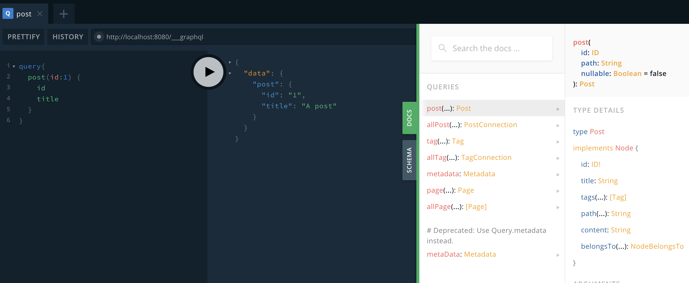

#### 6、Gridsome 基础——在页面中查询 GraphQL
+ 获取数据的两种方式，具体见文档<https://gridsome.org/docs/querying-data/>：
  1. Use <page-query> in Pages & Templates.
    + 在 /code/my-gridsome-site/src/Post2.vue 中的代码如下：
    ```js
    <template>
      <Layout>
        <div>
          <h1>Posts2</h1>
        </div>
      </Layout>
    </template>

    <page-query>
    query{
      posts: allPost{
        edges {
          node {
            id
            title
          }
        }
      }
    }
    </page-query>

    <script>
    import { Pager } from "gridsome";

    export default {
      components: {
        Pager
      }
    };
    </script>
    ```
    + 此时的 post2 组件实例下就有了 $page 的计算属性，见下图：
    + 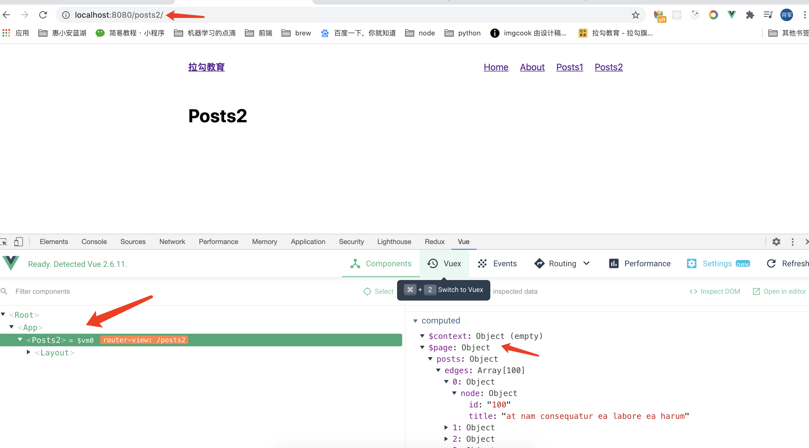
    + 此时页面中的动态数据（GraphQL 中的数据会在服务端被预渲染到页面中了）就被静态化到页面中了
  2. Use <static-query> in Components.

#### 7、Gridsome 基础——使用模板渲染节点页面
+ 在 /code/my-gridsome-site/gridsome.config.js 中添加模板配置：
```js
module.exports = {
  siteName: '拉勾教育', // 为您的项目设置一个名称。该名称通常在标题标签中使用。
  siteDescription: '大前端', // meta 标签里的 description 属性
  plugins: [],
  pathPrefix: '', // 加项目前缀，如果是根目录，则不用配置该属性。如果 gridsome 项目在根目录的子目录里，则 pathPrefix 值为子目录路径
  templates: { // 定义集合的路由和模板。
    Post: [
      {
        path: '/posts/:id',
        component: './src/templates/Post.vue'
      }
    ]
  }
}
```
+ /code/my-gridsome-site/src/templates/Post.vue 中的代码如下：
```js
<template>
  <Layout>
    <div>
      <h1>{{ $page.post.title }}</h1>
      <div>{{ $page.post.content }}</div>
    </div>
  </Layout>
</template>

<page-query>
query ($id: ID!) {
  post (id: $id) {
    id
    title
    content
  }
}
</page-query>

<script>
export default {
  name: "PostPage",
  metaInfo() {
    return {
      title: this.$page.post.title
    };
  }
  // metaInfo: {
  //   title: ''
  // }
};
</script>

<style>
</style>
```

#### 8、Gridsome 案例
+ 创建项目： gridsome create blog-with-gridsome
+ 处理首页模板
  + Fork Bootstrap的一个模板：https://github.com/StartBootstrap/startbootstrap-clean-blog
  + 然后执行git clone https://github.com/2604150210/startbootstrap-clean-blog --depth=1，只克隆最后一个版本就行了。
  + 然后回到我们的项目中，安装需要的依赖
  ```js
  npm i bootstrap
  npm i @fortawesome/fontawesome-free
  ```
  + 创建src/assets/css/index.css
  ```js
    @import url('https://fonts.googleapis.com/css?family=Lora:400,700,400italic,700italic');
    @import url('https://fonts.googleapis.com/css?family=Open+Sans:300italic,400italic,600italic,700italic,800italic,400,300,600,700,800')

    /* 下面将 startbootstrap-clean-blog 里面的 css/clean-blog.css 里面的内容复制到此处 */
  ```
  + 将 startbootstrap-clean-blog 项目中的 index.html 里的 body 中的内容拷贝至 blog-with-gridsome 的 Index.vue 的 template 中
  + 把 startbootstrap-clean-blog 中的 img 文件夹拷贝到 blog-with-gridsome 中的 static 中，作为静态资源使用。并将 Index.vue 中的图片路劲 修改为 根路径（/img/具体图片）
+ 处理其它页面模板
  + 将 Index.vue 中的头部、尾部代码剪切到 layouts/Default.vue 中，注意头尾代码块中间要放一个 <slot/> 插槽
  + 然后将 Index.vue 的最外层组件由 div 改为 Layout。Layout 已经在全局注册过了，可以直接使用
  + 然后写 Post.vue、About.vue、Contact.vue 页面，把 startbootstrap-clean-blog 中的 post.html、about.html、contact.html 中的代码拿过来即可。
+ 使用本地 md 文件管理文章内容，具体见官网<https://gridsome.org/plugins/@gridsome/source-filesystem>
  + npm i @gridsome/source-filesystem
  + npm i @gridsome/transformer-remark # 转换MD文件 
  + 在 gridsome.config.js 中配置 plugins 来导入数据
  ```js
  module.exports = {
    siteName: 'Gridsome',
    plugins: [
      {
        use: '@gridsome/source-filesystem',
        options: {
          typeName: 'BlogPost',
          path: './content/blog/**/*.md',
        }
      }
    ]
  }
  ```
  + 创建两个 md 文件， content/blog/article1.md、contetn/blog/artcle2.md
  + 在 GraphQL 中查询数据：
  + 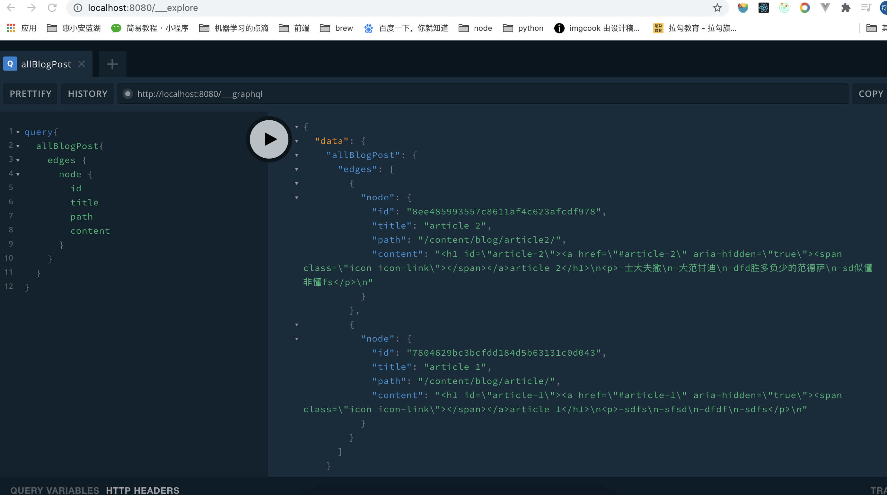
+ Strapi 介绍
  + 网址：https://strapi.io/
  + strapi 是一个通用的内容管理系统。
  + 执行创建 strapi 命令
  ```js
  npx create-strapi-app my-project --quickstart
  ```
  + 创建成功后会自动打开如下网址：
  + 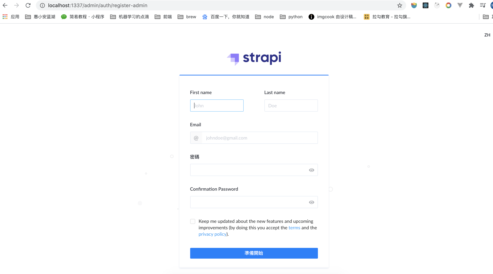
+ Strapi 基本使用
  + 创建一个集合
  + 
  + 在集合中新增一条数据
  + 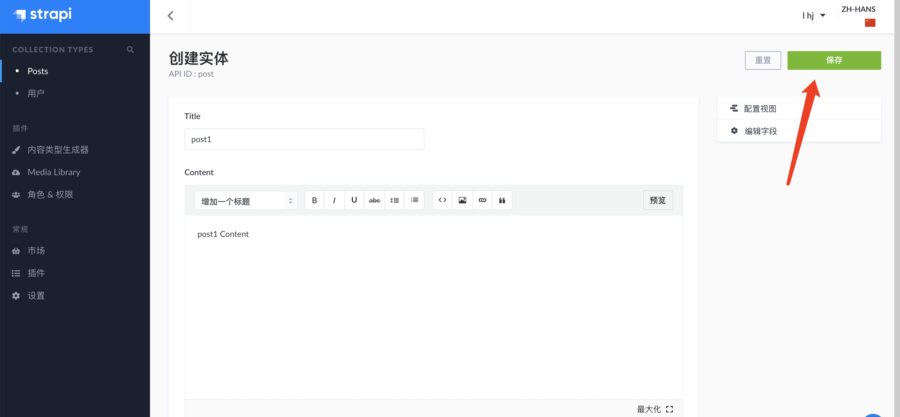
  + 
+ 使用 Strapi 接口数据
  + 默认是Restful API
  + https://strapi.io/documentation/v3.x/content-api/api-endpoints.html#get-an-entry
  + 配置权限
  + 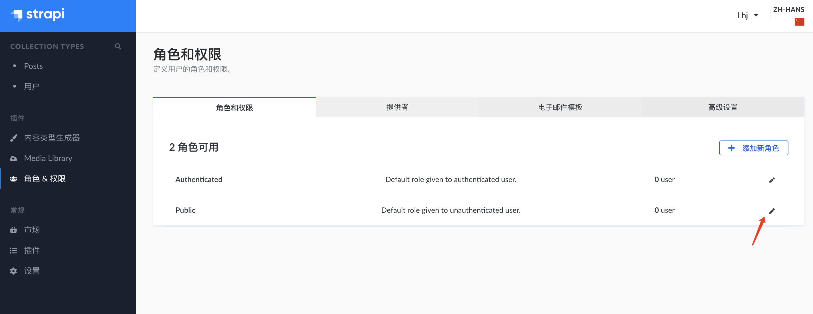
+ 访问受保护的 API
  + 
  + 
  + 
  + 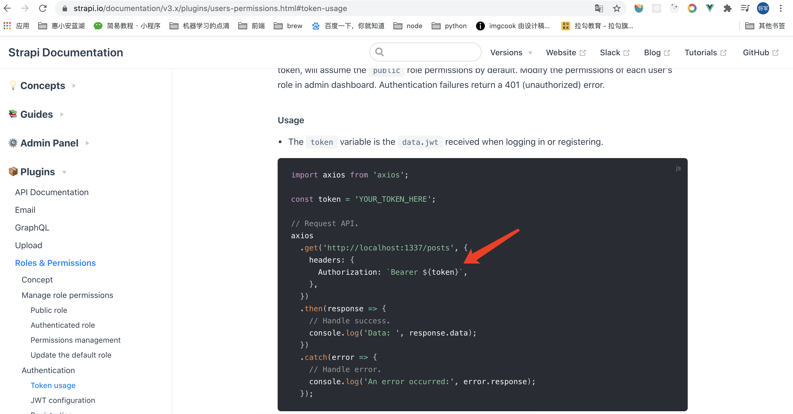
  + 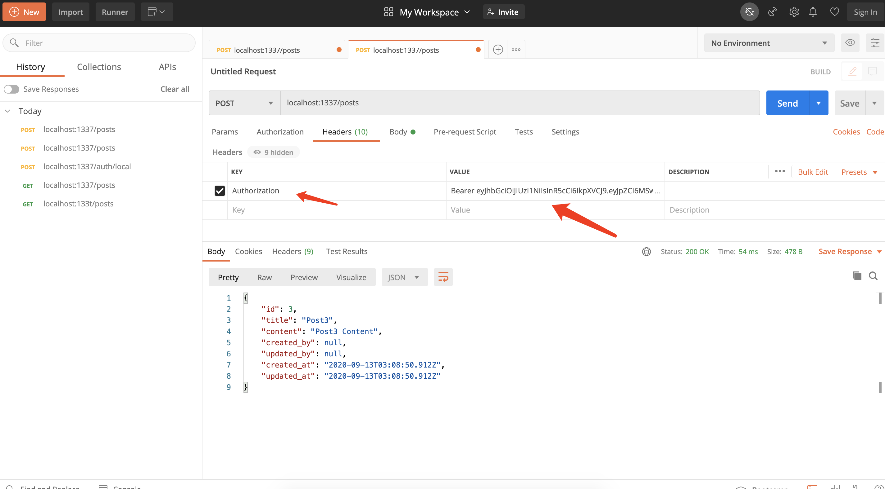
+ 通过 GraphQL 访问 Strapi
  + npm run strapi install graphql
+ 将 Strapi 数据预取到 Gridsome 应用中
  + 安装：npm install @gridsome/source-strapi
  + gridsome.config.js 中添加配置：
  ```js
  module.exports = {
    siteName: 'Gridsome',
    plugins: [
      {
        use: '@gridsome/source-strapi',
        options: {
          apiURL: 'http://localhost:1337',
          queryLimit: 1000, // Defaults to 100
          contentTypes: ['post'],
        }
      }
    ]
  }
  ```
  + 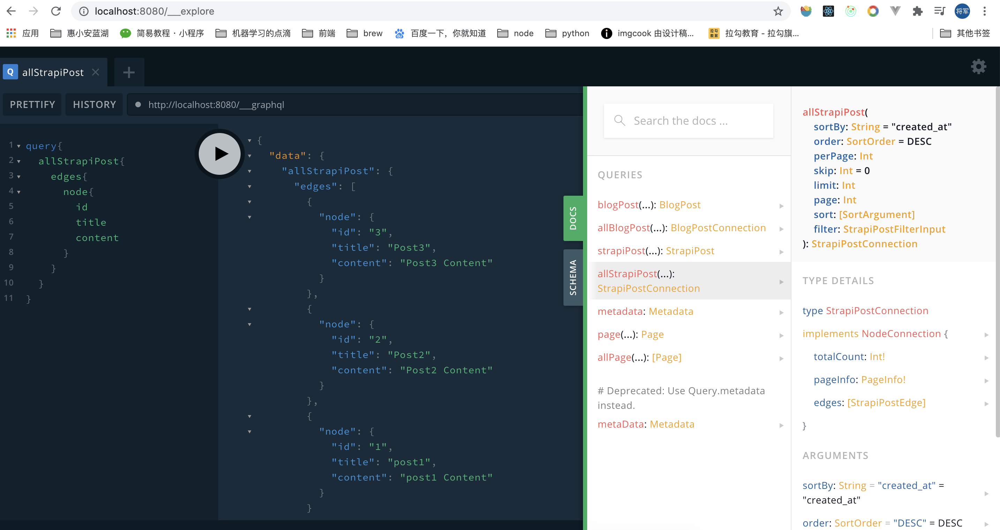
  + 重启应用，才会拉取最新数据。
+ 设计文章和标签数据模型
  + 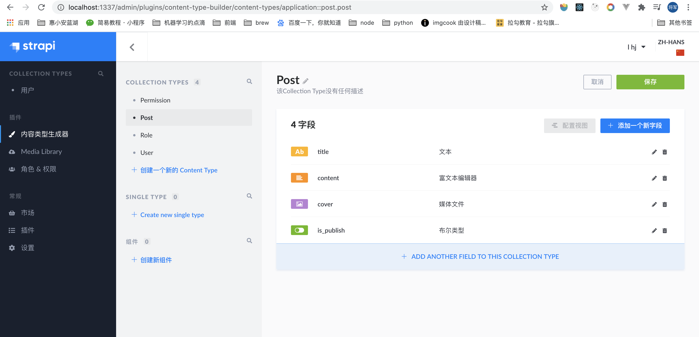
  + 
  + 
+ 展示文章列表
```js
<template>
  <Layout>
    <!-- Page Header -->
    <header class="masthead" style="background-image: url('/img/home-bg.jpg')">
      <div class="overlay"></div>
      <div class="container">
        <div class="row">
          <div class="col-lg-8 col-md-10 mx-auto">
            <div class="site-heading">
              <h1>Clean Blog</h1>
              <span class="subheading">A Blog Theme by Start Bootstrap</span>
            </div>
          </div>
        </div>
      </div>
    </header>

    <!-- Main Content -->
    <div class="container">
      <div class="row">
        <div class="col-lg-8 col-md-10 mx-auto">
          <div class="post-preview" v-for="edge in $page.posts.edges" :key="edge.node.id">
            <a href="post.html">
              <h2 class="post-title">{{edge.node.title}}</h2>
            </a>
            <p class="post-meta">
              Posted by
              <a
                href="#"
              >{{edge.node.created_by.firstname + edge.node.created_by.lastname}}</a>
              on {{edge.node.created_at}}
            </p>
            <p>
              <span v-for="tag in edge.node.tags" :key="tag.id">
                <a href>{{tag.title}}</a>
                &nbsp;&nbsp;
              </span>
            </p>
            <hr />
          </div>

          <!-- Pager -->
          <div class="clearfix">
            <a class="btn btn-primary float-right" href="#">Older Posts &rarr;</a>
          </div>
        </div>
      </div>
    </div>
  </Layout>
</template>

<page-query>
query ($page: Int){
	posts:allStrapiPost (perPage: 1, page: $page) @paginate {
    pageInfo {
      totalPages
      currentPage
    }
    edges{
      node{
        id
        title
        created_by{
          id
          firstname
          lastname
        }
        tags{
          id
          title
        }
        created_at
      }
    }
  }
}
</page-query>

<script>
export default {
  name: "HomePage",
  metaInfo: {
    title: "Hello, world!"
  }
};
</script>

<style>
</style>
```
+ 文章列表分页,具体见官网<https://gridsome.org/docs/pagination/#paginated-collections>
  ```js
  <page-query>
  query ($page: Int){
    posts:allStrapiPost (perPage: 1, page: $page) @paginate {
      pageInfo {
        totalPages
        currentPage
      }
      edges{
        node{
          id
          title
          created_by{
            id
            firstname
            lastname
          }
          tags{
            id
            title
          }
          created_at
        }
      }
    }
  }
  </page-query>
  ```
  + Pager component
  ```js
  <template>
    <Layout>
      <ul>
        <li v-for="edge in $page.allBlogPost.edges" :key="edge.node.id">
          {{ edge.node.title }}
        </li>
      </ul>
      <Pager :info="$page.allBlogPost.pageInfo"/>
    </Layout>
  </template>

  <script>
  import { Pager } from 'gridsome'

  export default {
    components: {
      Pager
    }
  }
  </script>
  ```
+ 展示文章详情
  + gridsome.config.js 中添加 template 属性配置
  ```js
  module.exports = {
    siteName: 'Gridsome',
    plugins: [
      {
        use: '@gridsome/source-filesystem',
        options: {
          typeName: 'BlogPost',
          path: './content/blog/**/*.md',
        }
      },
      {
        use: '@gridsome/source-strapi',
        options: {
          apiURL: 'http://localhost:1337',
          queryLimit: 1000, // Defaults to 100
          contentTypes: ['post'],
          // singleTypes: ['impressum'],
          // Possibility to login with a Strapi user,
          // when content types are not publicly available (optional).
          // loginData: {
          //   identifier: '',
          //   password: ''
          // }
        }
      }
    ],
    templates: {
      // StrapiPost为上面Plugin中配置的typeName和contentTypes的组合
      StrapiPost: [
        {
          path: '/post/:id',
          component: './src/templates/Post.vue'
        }
      ]
    }
  }
  ```
  + src/templates/Post.vue
  ```js
  <template>
    <Layout>
      <!-- Page Header -->
      <header
        class="masthead"
        :style="{backgroundImage: `url(http://localhost:1337${$page.post.cover.url})`}"
      >
        <div class="overlay"></div>
        <div class="container">
          <div class="row">
            <div class="col-lg-8 col-md-10 mx-auto">
              <div class="post-heading">
                <h1>{{$page.post.title}}</h1>
                <span class="meta"
                  >Posted by
                  <a href="#">{{$page.post.created_by.firstname + $page.post.created_by.lastname}}</a>
                  on {{$page.post.created_at}}</span
                >
              </div>
            </div>
          </div>
        </div>
      </header>

      <!-- Post Content -->
      <article>
        <div class="container">
          <div class="row">
            <div class="col-lg-8 col-md-10 mx-auto">
              {{$page.post.content}}
            </div>
          </div>
        </div>
      </article>
    </Layout>
  </template>

  <page-query>
  query($id: ID!) {
    post: strapiPost(id: $id) {
      id
      title
      content
      cover {
        url
      }
      tags {
        id
        title
      }
      created_at
      created_by {
        id
        firstname
        lastname
      }
    }
  }
  </page-query>

  <script>
  export default {
    name: 'PostPage'
  }
  </script>

  <style></style>
  ```
+ 处理 Markdown 格式的文章内容
+ 安装markdown处理器：`npm install markdown-it`
+ src/templates/Post.vue
  ```js
  <div class="col-lg-8 col-md-10 mx-auto" v-html="mdToHtml($page.post.content)">
  </div>

  <script>
  import MarkDownIt from 'markdown-it'
  const md = new MarkDownIt()
  export default {
    name: 'PostPage',
    methods: {
      mdToHtml (markdown) {
      return md.render(markdown)
    }
    }
  }
  </script>
  ```
+ 文章标签
  + gridsome.config.js 》plugins 》 @gridsome/source-strapi 》options 》 contentTypes 数组中添加 tags 集合
  ```js
  contentTypes: ['post','tag']
  ```
  + gridsome.config.js 》templates 》StrapiTag 属性中添加如下代码:
  ```js
  StrapiTag: [
    {
      path: '/tag/:id',
      component: './src/templates/Tag.vue'
    }
  ]
  ```
  + src/template/Tag.vue
  ```js
  <template>
      <Layout>

      <!-- Page Header -->
      <header class="masthead" style="background-image: url('/img/home-bg.jpg')">
        <div class="overlay"></div>
        <div class="container">
          <div class="row">
            <div class="col-lg-8 col-md-10 mx-auto">
              <div class="site-heading">
                <h1># {{$page.tag.title}}</h1>
              </div>
            </div>
          </div>
        </div>
      </header>

      <!-- Main Content -->
      <div class="container">
        <div class="row">
          <div class="col-lg-8 col-md-10 mx-auto">
            <div class="post-preview" v-for="post in $page.tag.posts" :key="post.id">
              <g-link :to="'post/'+post.id">
                <h2 class="post-title">
                  {{post.title}}
                </h2>
              </g-link>
              <p class="post-meta">
                Posted by
                on {{post.created_at}}
              </p>
              <hr />
            </div>
          </div>
        </div>
      </div>

    </Layout>
  </template>

  <page-query>
  query($id: ID!) {
    tag: strapiTag(id: $id) {
      title
      id
      posts {
        id
        title
        created_at
      }
    }
  }
  </page-query>

  <script>
  export default {
    name: 'TagPage'
  }
  </script>

  <style>

  </style>
  ```
+ 基本设置
  + 创建一个 single type 类型
  + 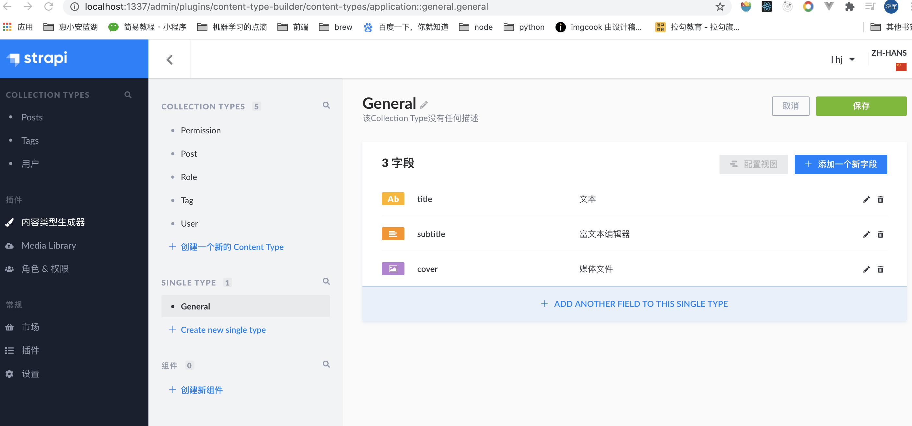
  + gridsome.config.js 》plugins 》 @gridsome/source-strapi 》options 》 singleTypes 数组中添加 general 
  ```js
  singleTypes: ['general'],
  ```
  + src/Index.vue
  ```js
  <!-- Page Header -->
      <header
        class="masthead"
        :style="{
          backgroundImage: `url(http://localhost:1337${general.cover.url})`
        }"
      >
        <div class="overlay"></div>
        <div class="container">
          <div class="row">
            <div class="col-lg-8 col-md-10 mx-auto">
              <div class="site-heading">
                <h1>{{general.title}}</h1>
                <span class="subheading">{{general.subtitle}}</span>
              </div>
            </div>
          </div>
        </div>
      </header>
  ```

  ```js
  <page-query>
  query ($page: Int) {
    ...
    general: allStrapiGeneral {
      edges {
        node {
          title
          subtitle
          cover {
            url
          }
        }
      }
    }
  }
  </page-query>
  ```

  ```js
  <script>
  import { Pager } from 'gridsome'
  export default {
    ...
    computed: {
      general () {
        return this.$page.general.edges[0].node
      }
    }
  };
  </script>
  ```
+ 联系我
  + 新建 contact 集合
  + 
  + Contact.vue
  ```js
  <template>
    <Layout>
      <!-- Page Header -->
      <header class="masthead" style="background-image: url('/img/contact-bg.jpg')">
        <div class="overlay"></div>
        <div class="container">
          <div class="row">
            <div class="col-lg-8 col-md-10 mx-auto">
              <div class="page-heading">
                <h1>Contact Me</h1>
                <span class="subheading">Have questions? I have answers.</span>
              </div>
            </div>
          </div>
        </div>
      </header>

      <!-- Main Content -->
      <div class="container">
        <div class="row">
          <div class="col-lg-8 col-md-10 mx-auto">
            <p>Want to get in touch? Fill out the form below to send me a message and I will get back to you as soon as possible!</p>
            <!-- Contact Form - Enter your email address on line 19 of the mail/contact_me.php file to make this form work. -->
            <!-- WARNING: Some web hosts do not allow emails to be sent through forms to common mail hosts like Gmail or Yahoo. It's recommended that you use a private domain email address! -->
            <!-- To use the contact form, your site must be on a live web host with PHP! The form will not work locally! -->
            <form name="sentMessage" id="contactForm" novalidate>
              <div class="control-group">
                <div class="form-group floating-label-form-group controls">
                  <label>Name</label>
                  <input
                    v-model="form.name"
                    type="text"
                    class="form-control"
                    placeholder="Name"
                    id="name"
                    required
                    data-validation-required-message="Please enter your name."
                  />
                  <p class="help-block text-danger"></p>
                </div>
              </div>
              <div class="control-group">
                <div class="form-group floating-label-form-group controls">
                  <label>Email Address</label>
                  <input
                    type="email"
                    v-model="form.email"
                    class="form-control"
                    placeholder="Email Address"
                    id="email"
                    required
                    data-validation-required-message="Please enter your email address."
                  />
                  <p class="help-block text-danger"></p>
                </div>
              </div>
              <div class="control-group">
                <div class="form-group col-xs-12 floating-label-form-group controls">
                  <label>Phone Number</label>
                  <input
                    v-model="form.phone"
                    type="tel"
                    class="form-control"
                    placeholder="Phone Number"
                    id="phone"
                    required
                    data-validation-required-message="Please enter your phone number."
                  />
                  <p class="help-block text-danger"></p>
                </div>
              </div>
              <div class="control-group">
                <div class="form-group floating-label-form-group controls">
                  <label>Message</label>
                  <textarea
                    v-model="form.message"
                    rows="5"
                    class="form-control"
                    placeholder="Message"
                    id="message"
                    required
                    data-validation-required-message="Please enter a message."
                  ></textarea>
                  <p class="help-block text-danger"></p>
                </div>
              </div>
              <br />
              <div id="success"></div>
              <button
                type="submit"
                class="btn btn-primary"
                id="sendMessageButton"
                @click.prevent="onSubmit"
              >Send</button>
            </form>
          </div>
        </div>
      </div>
    </Layout>
  </template>

  <script>
  import axios from "axios";
  export default {
    name: "ContactPage",
    data() {
      return {
        form: {
          name: "",
          email: "",
          phone: "",
          message: ""
        }
      };
    },
    methods: {
      async onSubmit() {
        try {
          const { data } = await axios({
            method: "POST",
            url: "http://localhost:1337/contacts",
            data: this.form
          });
          window.alert("发送成功");
        } catch (e) {
          alert("发送失败，请稍后重试");
        }
      }
    }
  };
  </script>
  ```
+ 部署 Strapi
  + 先部署 strapi、再部署 Gridsome。strapi 部署环境依赖于 node 环境的服务器，而 Gridsome 只需要支持静态网页的服务器就行。 
  + 配置为strapi后台服务配置数据库为MySQL
    + 其他数据库配置可以参考这里：https://strapi.io/documentation/v3.x/concepts/configurations.html#database
    + /code/my-project/config/database.js
    ```js
    module.exports = ({ env }) => ({
      defaultConnection: 'default',
      connections: {
        default: {
          connector: 'bookshelf',
          settings: {
            client: 'mysql',
            host: env('DATABASE_HOST', 'localhost'),// strapi部署的服务器与MySQL所在的服务器是同一个服务器，主机就直接写localhost
            port: env.int('DATABASE_PORT', 3306),
            database: env('DATABASE_NAME', 'blog'),
            username: env('DATABASE_USERNAME', 'blog'),
            password: env('DATABASE_PASSWORD', 'oPqc0Am9lfhWKNuT'),
          },
          options: {},
        },
      },
    });
    ```
    + 安装MySQL数据的依赖
    ```js
    npm install mysql
    ```
    + 将代码上传到gitee上
    ```js
    git init
    echo node_modules > .gitignore
    git add .
    git commit -m"第一次提交"
    git remote add origin https://gitee.com/lhuijun/blog-backend.git
    git push -u origin master
    ```
    + 进入 mysql: mysql -uroot -p
    + 创建一个用户：create user blog@localhost identified by '123456';
    + blog用户登录 ：mysql -u blog -p
    + 创建 blog 数据库：create database blog;
    + 查看数据库：show databases;
    + 使用 blog 数据库：use blog;
    + 创建表：create table blog (id varchar(20),wname varchar(20));
    + 插入数据：insert into blog values('lhj','刘惠俊');
    + 授权全部操作权限：grant all privileges on *.* to blog@localhost identified by '123456';
    + 连接服务器： ssh root@47.101.56.180
      + 服务器拉去代码：git clone https://gitee.com/lhuijun/blog-backend.git
      + cd blog-backend
      + npm i
      + npm run build(这一步如果卡在 90% 的话，就中断了 运行 npm run develop)
      + npm run start


### 任务三：封装 Vue.js 组件库
#### 1、课程目标
+ CDD(Component-Driven Development)
  + 自下而上
  + 从组件级别开始，到页面级别结束
+ CDD 的好处
  + 组件在最大程度被重用
  + 并行开发
  + 可视化测试
+ 课程介绍
  + 处理组件的边界情况
  + 快速原型开发
  + 组件开发
  + Storybook
  + Monorepo
  + 基于模板生成包的结构
  + Lerna + yarn workspaces
  + 组件测试
  + Rollup 打包
#### 2、处理组件的边界情况
+ $root
+ $parent/$children
+ $refs
```js
this.$refs[formName].validate((valid)=>{
  if(valid){
    alert('submit')
  }else{
    console.log('error submit!!!')
    return false
  }
})
```
+ 依赖注入 provide/inject
#### 3、$attrs/$listeners
+ $attrs: 把父组件中非 prop 属性绑定到内部组件
+ $listeners: 把父组件中的 DOM 对象的原生事件绑定到内部组件
#### 4、快速原型开发
+ VueCLI 中提供了一个插件可以进行原型快速开发
+ 需要先额外安装一个全局的扩展
  + npm install -g @vue/cli-service-global
+ 使用 vue serve 快速查看组件的运行效果
+ vue serve
  + vue serve 如果不指定参数默认会在当前目录找以下的入口文件
    + main.js、index.js、App.vue、app.vue
  + 可以指定要加载的组件
    + vue serve ./src/login.vue
+ ElementUI
  + 安装 ElementUI 
    + 初始化 package.json
      + npm init -y
  + 安装 ElementUI
    + vue add element
  + 加载 ElementUI，使用 Vue.use()安装插件
#### 5、组件开发
+ 组件分类
  + 第三方组件
  + 基础组件
  + 业务组件


