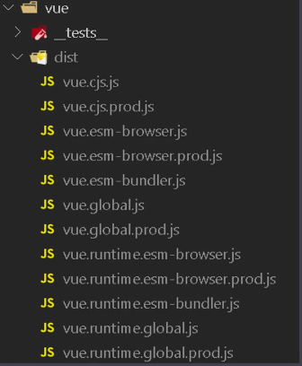

## Vue.js 3.0 Composition APIs 及 3.0 原理剖析 （项目见：<https://github.com/smallSix6/fed-e-task-liuhuijun/tree/master/fed-e-task-03-05>

### 任务一：Vue 3.0 介绍
#### 1、Vue 3.0 源码组织方式
+ 源码组织方式：
  + 源码采用 ts 重写
  + 使用 Monorepo 管理项目结构
  + packages 目录结构
    + 
    + compiler-core: 和平台无关的编译器代码
    + compiler-dom: 浏览器平台下的编译器代码(依赖于 compiler-core)
    + compiler-sfc: 编译单文件组件的代码(依赖于 compiler-core 和 compiler-dom)
    + compiler-ssr: 服务端渲染的编译器（依赖于 compiler-dom）
    + reactivity: 数据响应式的代码，可以独立使用
    + runtime-core: 和平台无关的运行时代码
    + runtime-dom: 浏览器下的运行时代码，处理原生 DOM 和事件等
    + runtime-test: 测试时的运行时代码
    + server-renderer: 服务端渲染
    + shared: 共用的 API
    + size-check: tree-shaking 之后检查包的大小
    + template-explorer: 针对浏览器编译时，会输出 render 函数
    + vue: 构建完整版的 Vue(依赖于 compiler 和 runtime)
#### 2、不同的构建版本
+ 
+ cjs（完整版）
  + vue.cjs.js: 开发版(未压缩)
  + vue.cjs.prod.js: 生产版
+ global
  + 完整版：
    + vue.global.js: 
    + vue.global.prod.js
  + 运行时版本：
    + vue.runtime.global.js
    + vue.runtime.global.prod.js
+ browser(浏览器 esm 版本):
  + 完整版
    + vue.esm-browser.js
    + vue.esm-browser.prod.js
  + 运行时
    + vue.runtime.esm-browser.js
    + vue.runtime.esm-browser.prod.js
+ bundler（没有打包所有的代码，需要配合打包工具来使用）
  + vue.esm-bundler.js
  + vue.runtime.esm-bundler.js
#### 3、Composition API 
+ RFC(Request For Comments): https://github.com/vuejs/rfcs
+ Composition API RFC: https://composition-api.vuejs.org
+ Options API（vue 2.0）
  + 
  + 包含一个描述组件选项（data、methods、props 等）的对象
  + Options API 开发复杂组件，同一个功能逻辑的代码被拆分到不同选项
+ Composition API
  + 
  + Vue.js 3.0 新增的一组 API
  + 一组基于函数的 API
  + 可以更灵活的组织组件的逻辑
+ 
#### 4、性能提升
+ 响应式系统升级
  + Vue.js 2.x 中响应式系统的核心 defineProperty
  + Vue.js 3.0 中使用 Proxy 对象重写响应式系统
    + 可以监听动态新增的属性
    + 可以监听删除的属性
    + 可以监听数组的索引和 length 属性
+ 编译优化
+ 源码体积的优化

