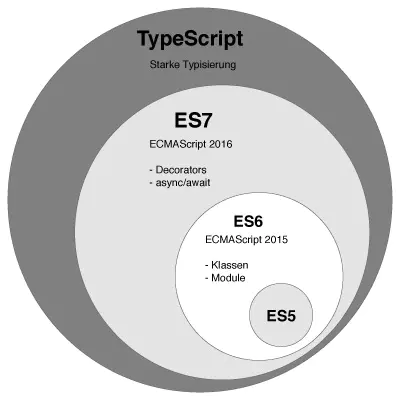

## typeScript 简介
+ TypeScript 并不是一个完全新的语言, 它是 JavaScript 的超集，为 JavaScript 的生态增加了类型机制，并最终将代码编译为纯粹的 JavaScript 代码。

### TypeScript 简介
+ TypeScript 由 Microsoft(算上 Angular 2 的话加上 Google)开发和维护的一种开源编程语言。 它支持 JavaScript 的所有语法和语义，同时通过作为 ECMAScript 的超集来提供一些额外的功能，如类型检测和更丰富的语法。下图显示了 TypeScript 与 ES5，ES2015，ES2016 之间的关系。
+ 

### 使用 TypeScript 的原因
+ 1、TypeScript 可以使用 JavaScript 中的所有代码和编码概念，TypeScript 是为了使 JavaScript 的开发变得更加容易而创建的。例如，TypeScript 使用类型和接口等概念来描述正在使用的数据，这使开发人员能够快速检测错误并调试应用程序
+ 2、TypeScript 从核心语言方面和类概念的模塑方面对 JavaScript 对象模型进行扩展。
+ 3、JavaScript 代码可以在无需任何修改的情况下与 TypeScript 一同工作，同时可以使用编译器将 TypeScript 代码转换为 JavaScript。
+ 4、TypeScript 通过类型注解提供编译时的静态类型检查。
+ 5、TypeScript 中的数据要求带有明确的类型，JavaScript不要求。
+ 6、TypeScript 引入了 JavaScript 中没有的“类”概念。
+ 7、TypeScript 中引入了模块的概念，可以把声明、数据、函数和类封装在模块中。
+ 8、类型注释是 TypeScript 的内置功能之一，允许文本编辑器和 IDE 可以对我们的代码执行更好的静态分析。 这意味着我们可以通过自动编译工具的帮助，在编写代码时减少错误，从而提高我们的生产力

### 数据类型
#### String 类型
+ 一个保存字符串的文本，类型声明为 string。可以发现类型声明可大写也可小写，后文同理。
```js
let name: string = 'aaaaaa'
let name2: String = 'aaaaaa'
```
#### Boolen 类型
+ boolean是 true 或 false 的值，所以 `let isBool: boolean = new Boolean(1)` 就会编译报错，因为 new Boolean(1) 生成的是一个 Bool 对象。
```js
let isBool1: boolean = false
```
#### Number 类型
```js
let number: number = 10
```
#### Array 类型
+ 数组是 Array 类型。然而，因为数组是一个集合，我们还需要指定在数组中的元素的类型。我们通过 Array\<type\> or type[] 语法为数组内的元素指定类型


